# Desain Laravel CD untuk Container Host

## Status dokumen

- Tanggal: 2026-09-13
- Status: siap direview
- Scope implementasi pertama: deployment Laravel ke Docker Compose pada VM development
- Target lanjutan: staging, production, dan adapter Kubernetes
- Acuan governance: `platform-governance@v1.5.0`

## Tujuan

Menyediakan golden path CD Laravel yang dapat digunakan ulang, terkontrol, dan
dapat diaudit. Implementasi membangun OCI image satu kali, mempromosikan digest
yang sama, melakukan deployment melalui akun terbatas, memverifikasi health, dan
mencatat evidence tanpa membocorkan secret.

Tahap pertama membuktikan alur pada environment `development`. Kontrak sejak
awal mempertahankan batas staging dan production agar perluasan berikutnya tidak
mengubah model keamanan atau identitas artifact.

## Keputusan arsitektur

### Model implementasi

Gunakan reusable workflow dan controlled action di `platform-workflow`.
Repository aplikasi hanya memiliki thin caller dan file aplikasi yang diperlukan.
Logika SSH, Docker Compose, health verification, rollback, evidence, permission,
dan validasi input tidak boleh diduplikasi di repository aplikasi.

Pendekatan shell bebas di caller ditolak karena sulit diaudit dan membuka variasi
antarproject. Deployment logic per repository juga ditolak karena meningkatkan
overhead operasi dan memungkinkan standar menyimpang.

### Registry dan identitas image

- Registry default adalah private GHCR.
- Publication menggunakan `GITHUB_TOKEN` dengan permission minimum.
- Deployment hanya menerima OCI digest dengan pola `^sha256:[a-f0-9]{64}$`.
- Tag mutable, termasuk `latest`, tidak boleh menjadi deployment identity.
- Target VM menggunakan credential pull khusus berjangka terbatas.
- Credential developer, akun personal, dan token permanen lintasproject dilarang.
- Kontrak registry harus dapat menerima registry internal pengganti pada versi
  berikutnya tanpa mengubah deployment contract.

### Target deployment pertama

Target pertama adalah Docker Compose pada VM. Database dan dependency stateful
berada di luar baseline Compose aplikasi. Web, queue worker, dan scheduler dapat
menjadi service terpisah yang menggunakan digest aplikasi yang sama.

Adapter Kubernetes menggunakan deployment contract dan evidence model yang sama,
tetapi tidak termasuk implementasi tahap pertama.

## Aliran data

```mermaid
flowchart LR
  A[Merge ke development] --> B[Validasi CI]
  B --> C[Build OCI satu kali]
  C --> D[Push private GHCR]
  D --> E[Catat image digest dan provenance]
  E --> F[Reusable deploy-development]
  F --> G[GitHub Environment development]
  G --> H[Runner platform-ci]
  H --> I[SSH deploy user]
  I --> J[Docker Compose pull by digest]
  J --> K[Start workload]
  K --> L[Health check /up]
  L --> M[Deployment evidence]
```

Tidak ada rebuild setelah OCI digest diterbitkan. Promotion berikutnya harus
menggunakan digest yang sama.

## Trigger dan environment

| Environment | Source | Eksekusi | Gate |
|---|---|---|---|
| development | merge ke `development` | otomatis | CI dan artifact qualification lulus |
| staging | promotion PR `development → staging` | otomatis setelah approval | PIC internal dan checks promotion |
| production | protected stable tag pada approved `main` SHA | manual | Development, Security, lalu authorization Operations |

Tahap pertama hanya mengaktifkan development. Merge ke `main` dan pembuatan tag
tidak boleh melakukan production deployment secara otomatis.

## Komponen

### OCI build workflow

Menghasilkan satu OCI image, digest, provenance reference, SBOM reference jika
tersedia, source SHA, workflow SHA, artifact ID, dan retention metadata. Workflow
tidak menerima arbitrary build command dari caller.

### Container-host deployment contract

Kontrak minimum:

- schema dan contract version;
- repository identity dan environment;
- source SHA, artifact ID, image reference, dan digest;
- target ID tanpa hostname atau credential sensitif;
- allowlisted Compose manifest dan service set;
- health URL/path, timeout, serta retry policy terkontrol;
- LKG digest/reference;
- release atau promotion reference jika berlaku;
- evidence mode.

Contract menolak unknown field, path absolut, traversal, inline command, mutable
image reference, secret value, dan target di luar environment yang dipilih.

### Deployment action

Action melakukan validasi contract, menyiapkan known hosts, membuka sesi SSH,
memastikan target identity, menarik image berdasarkan digest, menjalankan Docker
Compose secara idempotent, memverifikasi digest container aktif, dan membersihkan
material sementara pada semua terminal path.

Deploy user tidak memiliki root umum. Bila operasi tertentu membutuhkan privilege,
sudo dibatasi pada command wrapper yang telah diizinkan dan tidak menerima shell
bebas.

### Health verification

Baseline Laravel menggunakan `/up`. Deployment berhasil hanya jika:

1. container yang diharapkan berstatus berjalan;
2. digest aktif sama dengan digest contract;
3. endpoint health memberikan respons sukses dalam batas retry;
4. service wajib pada Compose manifest berada pada kondisi sehat;
5. safe deployment evidence berhasil dibentuk.

Migrasi database tidak otomatis dijalankan pada baseline tahap pertama. Perubahan
database memerlukan contract dan gate terpisah.

### LKG rollback

Sebelum deployment, action memvalidasi referensi Last Known Good (LKG). Jika pull,
start, digest verification, atau health check gagal, action mencoba menjalankan
kembali LKG digest yang sudah tercatat. Rollback tidak membangun image baru dan
tidak mengubah source branch.

Perbaikan permanen tetap mengikuti working branch, `development`, `staging`,
`main`, dan stable release.

### Deployment evidence

Safe evidence minimum mencatat:

- deployment attempt ID;
- repository, environment, dan target ID;
- source SHA, workflow SHA, artifact ID, serta image digest;
- actor class dan authorization reference tanpa credential;
- start/end time, terminal status, dan failure category;
- health verification result;
- previous dan resulting LKG reference;
- rollback attempted/result;
- governance control references.

Hostname internal, IP, username, token, SSH key, registry credential, environment
value, dan raw command output tidak boleh masuk safe evidence.

## Concurrency dan idempotensi

- Gunakan satu concurrency namespace per repository dan environment.
- Development boleh mengantre deployment baru, tetapi deployment aktif tidak
  dihentikan pada titik yang dapat meninggalkan target tidak konsisten.
- Staging dan production tidak menggunakan auto-cancel.
- Setiap retry memiliki deployment attempt ID baru dan hubungan ke attempt awal.
- Mengulang contract dengan digest yang sudah aktif menghasilkan hasil idempotent,
  bukan restart tanpa alasan.

## Error model

Kategori terminal minimum:

- `contract`: input tidak valid atau tidak diizinkan;
- `authorization`: environment/gate/identity tidak memenuhi syarat;
- `registry`: login atau pull gagal;
- `target-connectivity`: SSH atau target identity gagal;
- `deployment`: Compose validation/start gagal;
- `verification`: digest atau health mismatch;
- `rollback`: pemulihan LKG gagal;
- `platform`: kegagalan runner/action di luar aplikasi.

Pesan error harus aman, stabil, dan tidak memuat secret atau detail jaringan
internal.

## Security boundary

- Workflow memakai permission default `contents: read` dan menambah `packages:
  write` hanya pada publication job.
- Deployment secret hanya tersedia pada job yang memakai GitHub Environment.
- Known-host verification wajib; `StrictHostKeyChecking=no` dilarang.
- Host, manifest, service, health path, dan command wrapper harus allowlisted.
- Semua third-party action dan reusable workflow dipin ke full commit SHA.
- Material autentikasi sementara dihapus melalui cleanup yang selalu berjalan.

## Traceability governance

| Domain | Kontrol utama | Bukti implementasi |
|---|---|---|
| P04 | promotion, production release boundary | trigger, environment gate, immutable SHA/digest |
| P06 | build once dan no rebuild | OCI build output dan promotion digest |
| P07 | artifact identity, provenance, LKG | manifest, digest, provenance, rollback reference |
| P08 | environment, approval, deployment | contract, GitHub Environment, deployment evidence |
| P09 | runner boundary | runner label/group dan target network path |
| P10 | secret dan workload authentication | scoped credential, known hosts, cleanup evidence |

Status implementasi di traceability matrix tetap membedakan `documented`,
`implemented`, `verified`, dan `operationally-compliant`.

## Pengujian

### Unit dan contract

- schema menerima contract valid;
- unknown field, traversal, absolute path, command injection, secret-like field,
  mutable tag, malformed digest, dan cross-environment target ditolak;
- evidence sanitizer tidak meneruskan secret atau network detail;
- error category dan deployment attempt ID deterministik.

### Integration

- Compose config dan pull by digest diuji pada target fixture;
- deployment sukses memverifikasi digest dan `/up`;
- pull, start, digest mismatch, dan health failure diuji;
- rollback ke LKG dan rollback failure diuji;
- cleanup berjalan pada success maupun failure.

### Actual pilot

`example-app-laravel` digunakan sebagai certification fixture. Pilot development
harus membuktikan OCI publication, immutable digest, deployment, health check,
safe evidence, failure simulation, dan LKG rollback. Hasil pilot tidak otomatis
menaikkan status menjadi `operationally-compliant` tanpa assessment organisasi.

## Scope tahap pertama

Termasuk:

- OCI build dan publication untuk Laravel;
- container-host contract;
- Docker Compose deployment ke VM development;
- health verification `/up`;
- safe evidence dan LKG rollback;
- pengujian otomatis serta actual pilot.

Tidak termasuk:

- staging dan production activation;
- Kubernetes adapter;
- database migration automation;
- UI provisioning;
- multi-region, HA, atau disaster recovery orchestration;
- perubahan status governance menjadi supported atau operationally compliant.

## Kriteria penerimaan

1. Seluruh input deployment tervalidasi oleh schema dan policy checks.
2. Image dibangun satu kali serta di-deploy menggunakan digest immutable.
3. Thin caller tidak mengandung deployment logic atau arbitrary command.
4. Secret hanya tersedia pada deployment job dan tidak muncul pada evidence.
5. Actual development deployment lulus digest dan health verification.
6. Simulasi gagal membuktikan rollback ke LKG atau menghasilkan status rollback
   failure yang dapat ditindaklanjuti.
7. Traceability matrix menghubungkan setiap capability ke governance controls.
8. Test, lint, typecheck, repository validation, dan GitHub checks lulus.
