# Desain Trust Boundary Runner Public dan Private

Tanggal: 2026-09-13  
Status: siap untuk review formal  
Repository utama: `OXY7O/platform-workflow`

## Tujuan

Memanfaatkan kemampuan gratis repository public secara maksimal tanpa memberi
kode atau contributor public jalur menuju runner, secret, target deployment,
atau jaringan internal organisasi.

Desain ini memisahkan proses menjadi dua trust boundary:

1. public verification plane untuk CI, security, dan penerbitan artifact; dan
2. private delivery plane untuk approval, promotion, deployment, rollback, dan
   evidence internal.

`platform-governance` tetap menjadi sumber aturan. Dokumen dan implementasi di
`platform-workflow` menjadi pemetaan teknis yang lebih sering berubah.

## Keputusan utama

- Repository public hanya boleh memakai GitHub-hosted runner.
- Self-hosted runner dilarang pada seluruh workflow repository public.
- `platform-provisioning` tetap private dan menjadi delivery control plane.
- Self-hosted runner `platform-ci` hanya tersedia untuk repository private yang
  dipilih secara eksplisit.
- Artifact berpindah dari public ke private berdasarkan immutable digest,
  provenance, SBOM, dan identitas source; source tidak dibangun ulang pada sisi
  deployment.
- Secret internal, alamat target, SSH key, kubeconfig, credential registry
  private, dan konfigurasi runtime tidak boleh berada pada repository public.
- Repository public menggunakan fitur GitHub public yang relevan, bukan sekadar
  mengubah visibility.

## Arsitektur

```mermaid
flowchart LR
  A[Developer atau contributor] --> B[Pull request public]
  B --> C[GitHub-hosted CI]
  C --> D[Quality dan security gates]
  D --> E[OCI atau package immutable]
  E --> F[SBOM dan provenance]
  F --> G[Registry atau artifact store]
  G --> H[Private platform-provisioning]
  H --> I[Verifikasi digest dan provenance]
  I --> J[Environment approval]
  J --> K[Self-hosted platform-ci]
  K --> L[Target internal]
  L --> M[Health verification, LKG, rollback, evidence]
```

Tidak ada hubungan jaringan dari `C` menuju `K` atau `L`. Satu-satunya handoff
adalah artifact immutable dan metadata aman yang dapat diverifikasi ulang.

## Public verification plane

### Runner

Semua job memakai label GitHub-hosted eksplisit, misalnya `ubuntu-24.04`.
Workflow validator menolak `self-hosted`, `platform-ci`, runner group internal,
atau label custom lainnya pada repository public.

GitHub-hosted runner dianggap ephemeral. Cache hanya berisi dependency atau
build layer yang tidak sensitif, mempunyai key terikat lockfile/runtime, dan
tidak menjadi sumber kebenaran artifact.

### CI dan security gates

Baseline public menjalankan:

- frozen dependency restore;
- unit, integration, dan profile-specific test;
- coverage threshold;
- lint, format, type, dan repository contract validation;
- dependency review dan Dependabot;
- CodeQL untuk bahasa yang didukung;
- secret scanning dan push protection;
- container, filesystem, dan dependency vulnerability scanning;
- license/policy checks sesuai katalog governance;
- OCI/package build tanpa credential internal;
- SBOM, provenance, dan artifact attestation.

Pull request dari fork memperoleh token read-only dan tidak menerima secret.
Workflow berprivilege tidak memakai `pull_request_target` untuk menjalankan kode
contributor.

### Artifact contract

Artifact wajib:

- berasal dari commit SHA yang telah melewati required checks;
- mempunyai nama, artifact ID, version, digest, profile, dan lifecycle;
- diterbitkan dengan referensi immutable;
- mempunyai SBOM dan provenance yang mengikat source SHA serta workflow SHA;
- tidak memuat `.env`, private key, kubeconfig, credential, atau evidence
  internal;
- mempunyai retention dan cleanup policy;
- tidak otomatis memperoleh izin deployment hanya karena `ci-qualified`.

## Private delivery plane

`platform-provisioning` menerima request promotion atau deployment setelah
artifact public berstatus qualified. Input hanya berupa identifier yang telah
distandarkan: repository, source SHA, workflow SHA, artifact ID, immutable
reference, digest, target ID, environment, dan authorization reference.

Sebelum memakai self-hosted runner, control plane wajib memverifikasi:

1. artifact berasal dari repository dan workflow allowlist;
2. source SHA telah melewati required checks;
3. digest cocok dengan registry;
4. provenance serta attestation valid;
5. vulnerability policy tidak mempunyai finding pemblokir;
6. environment dan target sesuai authorization;
7. approval masih berlaku dan belum kedaluwarsa.

Deployment memakai environment-scoped secret. Runner internal tidak menerima
input perintah bebas, host bebas, compose path bebas, atau target bebas. Semua
eksekusi melewati adapter/wrapper allowlist.

## GitHub Environment dan deployment

Environment minimum adalah `development`, `staging`, dan `production`.

| Environment | Trigger | Approval | Runner | Deployment |
|---|---|---|---|---|
| Development | artifact qualified dan request private | sesuai baseline development | private `platform-ci` | otomatis setelah gate atau manual pilot |
| Staging | promotion dari artifact yang sama | internal project/PIC | private `platform-ci` | controlled promotion |
| Production | release authorization | developer/functional dan security sesuai governance | private production runner | manual controlled release |

Setiap environment mempunyai concurrency lock, target allowlist, secret
terpisah, audit trail, health verification, LKG, dan rollback evidence.
Production tidak otomatis deploy hanya karena merge ke `main`.

## Ruleset dan branch protection public

Ruleset organisasi menjadi baseline; repository ruleset hanya menambah kontrol
yang lebih ketat. Minimum untuk `main` dan branch canonical yang relevan:

- prohibit deletion dan force push;
- require pull request;
- require conversation resolution;
- require status checks yang didefinisikan katalog;
- require branch up to date atau merge queue jika kompatibel;
- require signed commits;
- block direct push, termasuk administrator kecuali break-glass terkontrol;
- require code owner review untuk path governance/workflow sensitif;
- restrict workflow modification melalui CODEOWNERS;
- hanya squash merge dan hapus branch setelah merge;
- tag release dilindungi dari update atau deletion;
- bypass actor minimum, berbasis team, tercatat, dan diaudit.

Workflow berprivilege dan dependabot configuration diperlakukan sebagai path
sensitif. Perubahan pada `.github/workflows/**`, action source, contract,
catalogue, Dockerfile runtime, serta security configuration membutuhkan review
platform/security sesuai segregation of duty.

## Fitur repository public

Baseline yang diaktifkan bila didukung repository:

- Issues, Discussions, Projects, dan Wiki sesuai fungsi repository;
- Dependabot alerts dan security updates;
- dependency graph serta dependency review;
- secret scanning dan push protection;
- CodeQL default atau advanced setup untuk bahasa yang didukung;
- private vulnerability reporting dan security advisories;
- artifact attestation serta provenance;
- branch ruleset, tag ruleset, merge queue bila tersedia;
- public package/container visibility hanya untuk artifact yang memang disetujui;
- community health files: `SECURITY.md`, `CONTRIBUTING.md`, code of conduct,
  support policy, issue forms, dan pull request template;
- lisensi yang disetujui organisasi sebelum artefak dinyatakan reusable oleh
  pihak luar.

Fitur tidak diaktifkan hanya untuk mengejar jumlah. Fitur harus mempunyai owner,
tujuan, dan alur respons. Contohnya, Discussions tanpa moderator atau security
reporting tanpa SLA tidak boleh dianggap operationally ready.

## Repository classification

| Repository | Visibility | Alasan |
|---|---|---|
| `platform-governance` | Private | policy, assessment, register, dan evidence reference organisasi |
| `platform-provisioning` | Private | request, mapping, target, approval, dan deployment control plane |
| `platform-workflow` | Public | reusable technical implementation tanpa data internal |
| `platform-runtime-images` | Public | reproducible governed CI runtime images |
| `example-app-*` | Public | verifikasi, dokumentasi, dan demonstrasi golden flow |
| starter/template generic | Public bila bebas data internal | onboarding dan golden path reusable |
| generated application repository | mengikuti klasifikasi aplikasi | bukan otomatis public karena berasal dari template public |

## Threat model dan kontrol

### Kode contributor menjalankan perintah pada internal runner

Dicegah dengan larangan self-hosted pada public repository dan validator
machine-readable. Runner group internal tidak mengizinkan public repository.

### Secret bocor ke pull request public

Dicegah dengan permission read-only, tanpa inherited secret, tanpa
`pull_request_target` yang mengeksekusi kode contributor, environment secret
hanya di private plane, serta push protection.

### Artifact diganti setelah approval

Dicegah dengan digest pinning, protected tag, provenance verification, dan
promosi artifact yang sama tanpa rebuild.

### Artifact berbahaya mencapai jaringan internal

Dicegah dengan vulnerability gate, provenance allowlist, isolated pull/scan,
deployment adapter allowlist, target-side least privilege, segmentasi jaringan,
health verification, dan rollback LKG.

### Workflow supply-chain compromise

Dicegah dengan full commit SHA untuk action eksternal, CODEOWNERS, required
reviews, restricted permissions, attestation, dependency update automation, dan
periodic pin refresh.

## Failure handling

- CI gagal: artifact tidak diterbitkan atau ditandai tidak qualified.
- Attestation/SBOM gagal: publikasi dianggap gagal.
- Verification private gagal: deployment tidak memperoleh runner slot.
- Deployment gagal sebelum health success: status `failed`; LKG tetap aktif.
- Deployment gagal setelah perubahan aktif: wrapper menjalankan rollback LKG
  sesuai kontrak dan menghasilkan evidence aman.
- Evidence gagal dibuat: deployment tidak dinyatakan complete meskipun service
  sehat; finding operasional dibuka.
- Runner private unavailable: request tetap antre dan tidak dialihkan ke runner
  public.

## Observability dan evidence

Public evidence hanya memuat metadata aman. Private evidence register menyimpan
run ID, actor, approval, artifact identity, digest, provenance reference,
environment, target ID tersamarkan bila perlu, timestamps, result, LKG, rollback,
dan evidence storage reference. Nilai secret, host, username, token, log sensitif,
dan konfigurasi runtime tidak dimasukkan.

Evidence aktual disimpan pada object storage yang disetujui dan direferensikan
melalui evidence ID serta checksum sebagaimana platform governance.

## Tahapan implementasi

1. Ubah seluruh job public menjadi GitHub-hosted dan tambahkan validator yang
   melarang runner internal.
2. Lengkapi security/community configuration dan ruleset public.
3. Pertahankan OCI build public; verifikasi digest, SBOM, dan provenance aktual.
4. Pindahkan orchestration deployment ke `platform-provisioning` private.
5. Tambahkan artifact-verification gate sebelum self-hosted runner.
6. Jalankan pilot development, negative test, dan LKG rollback.
7. Dokumentasikan actual evidence dan baru terbitkan SemVer release.
8. Ulangi model yang sama untuk Go dan .NET tanpa menyalin secret atau target.

## Kriteria penerimaan

- Tidak ada `self-hosted` atau `platform-ci` pada workflow repository public.
- Public CI, CodeQL yang relevan, dependency/security checks, build, SBOM,
  provenance, dan attestation berhasil.
- Fork PR tidak dapat membaca secret atau menjalankan job internal.
- Deployment hanya dapat dimulai dari private control plane.
- Artifact yang dideploy sama digest-nya dengan artifact public yang diverifikasi.
- Environment approval, concurrency, target allowlist, health, LKG, rollback, dan
  evidence lulus positive serta negative test.
- Ruleset dan community/security features mempunyai konfigurasi serta owner yang
  terdokumentasi.
- Release hanya menunjuk merge SHA yang telah diverifikasi.

## Di luar scope rilis awal

- self-hosted runner untuk repository public;
- automatic production deployment;
- arbitrary deployment plugin atau arbitrary command;
- akses langsung public workflow ke cluster, VM, atau jaringan internal;
- pemindahan assessment/evidence internal ke repository public.

Runner public mandiri hanya dapat dipertimbangkan kembali sebagai desain baru
bila ephemeral per-job, disposable, terisolasi jaringan, tanpa credential
persisten, dan mempunyai independent security assessment.
